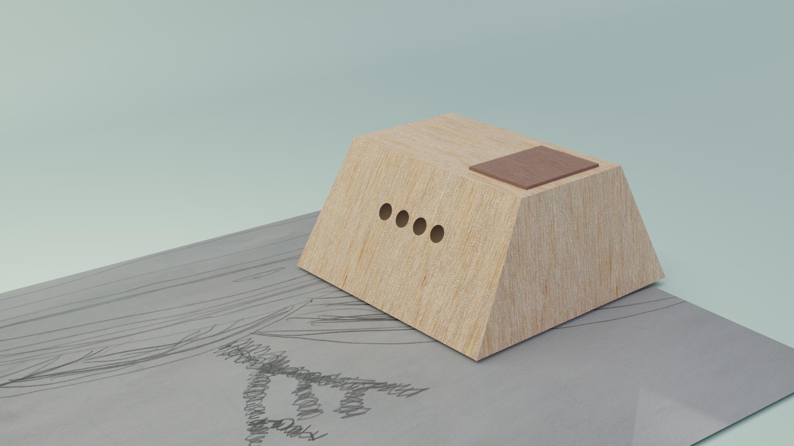
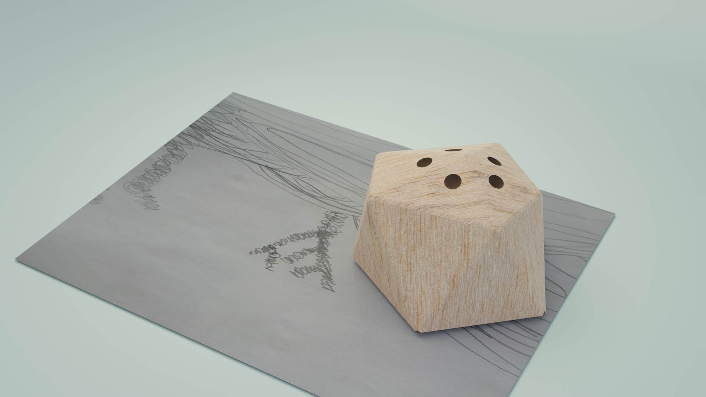
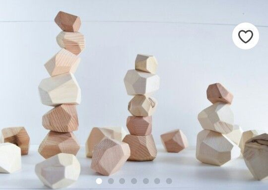
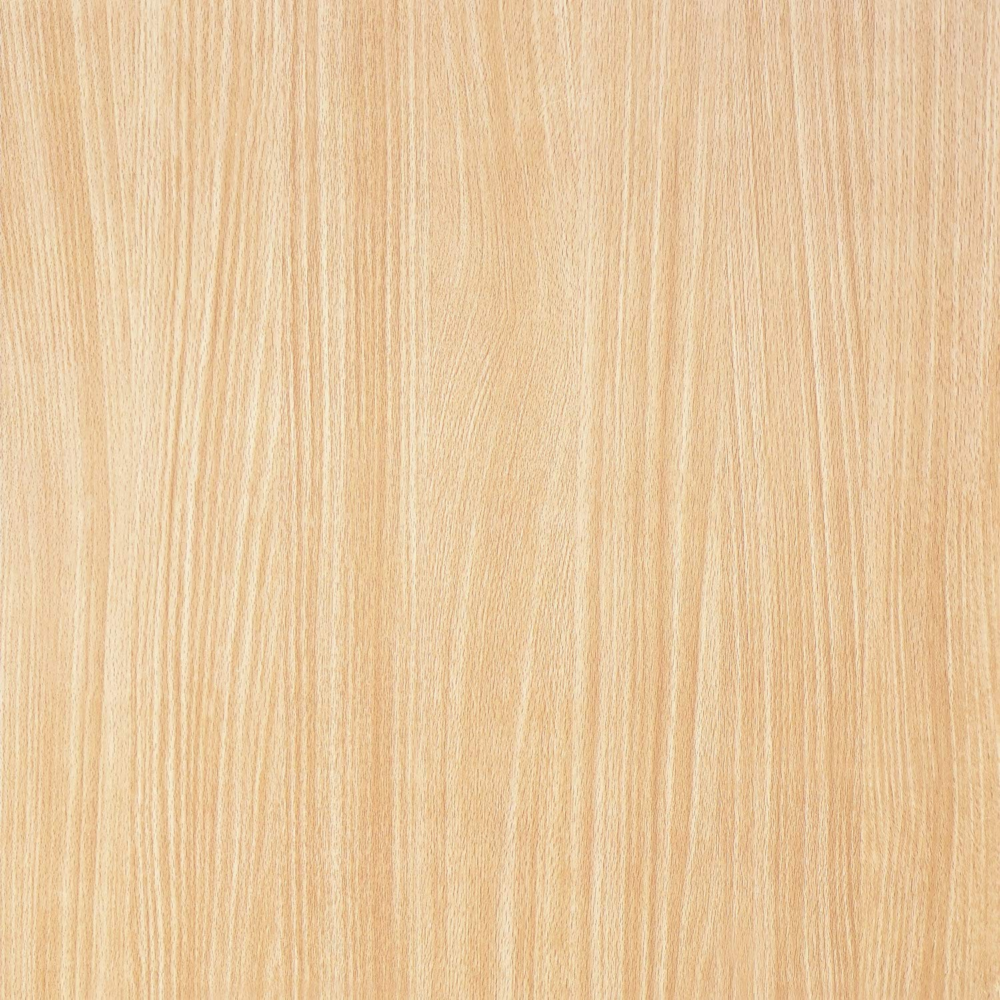
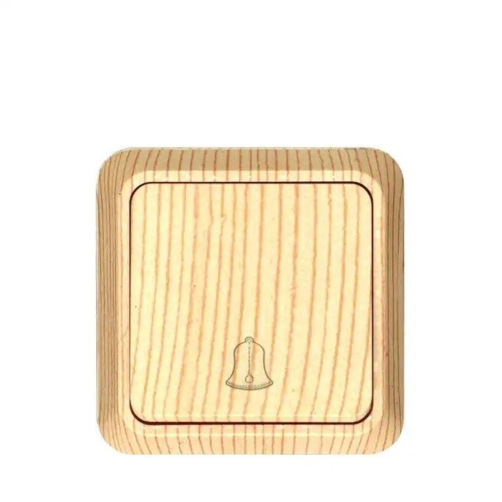
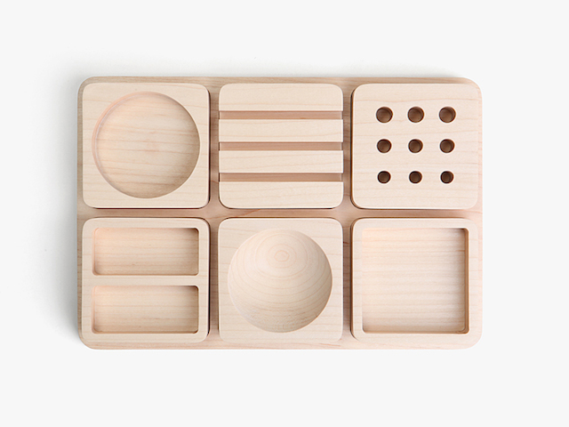
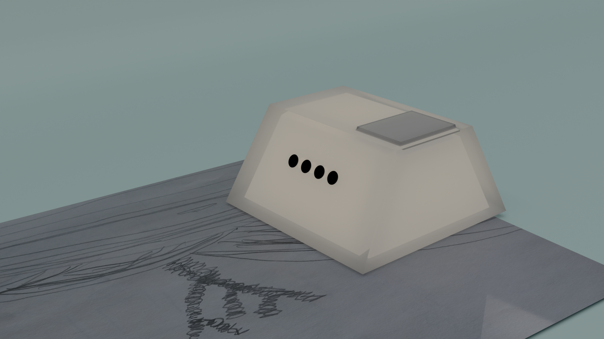
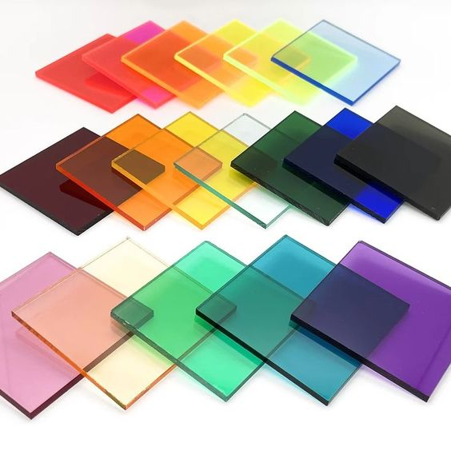
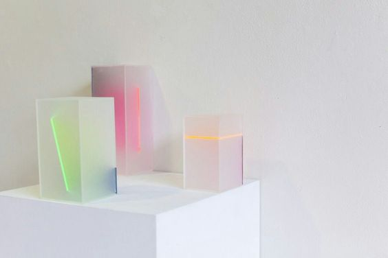
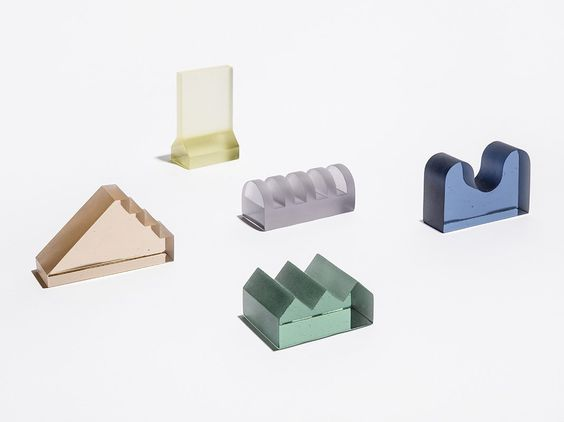

02-12-2023
# Forms & textures 
---

I'm aiming to get the for similar to the drawing objects and to create a cohesion between them and the robot.

---

### FORMS

### 01

for this one i'm inspiring myself from one of the drawing tools. (the rake like one) 

Keeping a simple box-like shape help associate it with the tools that are also squared/rectangular.

Adding an other wooden tone to the button could add to the envy to press it or to interact with it more clearly.

---

### 02

This shape is inspired by this picture of wooden stones.

As the tools and the process presented during 2023-11-16 presentation, where reminding of a zen garden and a calming process, this weirder shape could help carrying this idea.

I'm still not sure about the holes on this one as they seems weird and closer to a salt shaker than a rock.

---

### TEXTURES

### 01 : Light-wood

I'm choosing light wood as a first iteration, it is closer to a more hand made esthetic, it make sens as the robot produce sounds, it feels warm and is a calming material.

---

### 02 : Acrylics

During the 2023-11-16 feedback, there was a question about adding a way to project from the robot or to make it emit light. This could be possible with acrylics that can diffuse light in a soft way and could add an other layer to the project.

On the other hand it might feel more industrial, more superficial and could be harder to manufacture.

Also the wooden drawing tools design make more sens than making them in acrylics.

