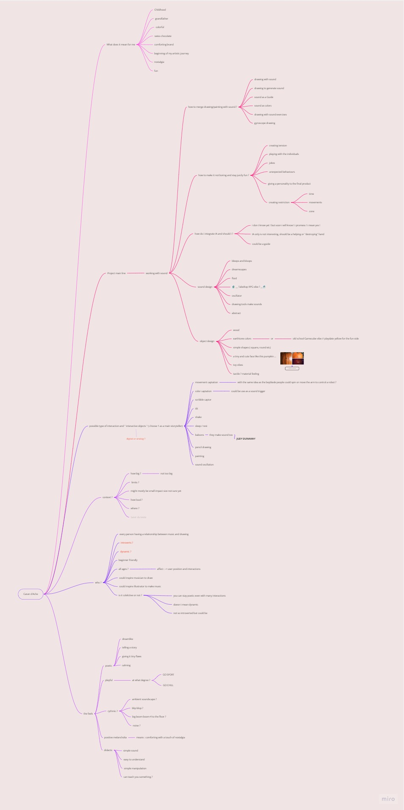

___
2023
# First Intentions
###### link to my miro : 
___
where i started :

-> Would like to focus my main theme and research around sound-drawing relationship.

I started finding some inspiration throught art piece, music and design work.

___

### Inspiration :

###### - miro references section / screen from : 2023-10-17 -
- perplex on : https://twitter.com/PerplexOn
- Loom : https://www.iorama.studio/looom
- Fragile contemporary : https://www.instagram.com/fragiletemporary/?hl=fr
- Kyong-Ho : https://www.youtube.com/watch?v=RWqr9DsEd9Q 

Following the inspiration i started to structure my project research throught simple questions and themes.

___

### Main Structure :

###### - miro main section / screen from : 2023-10-17 -

note : this tree will evolve and will be updated in future sections.

Making this main linse structure helped me put words on ideas and to create a thinking machine.