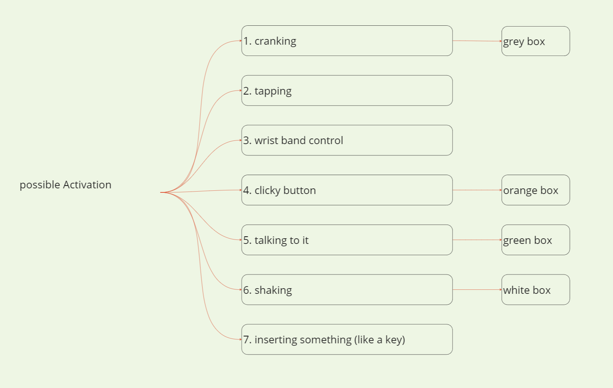

02-11-2023
# Studio Work 

---

### Today objectives :
1. Creating list of possible activation and chose one for each box
2. Prototype 2 -> grey box
3. Prototype 3 -> Colorful/flashy box
4. Prototype 4 -> white box
5. Sound design prototypes
6. Taking prototype 1, 2, 3, 4 pictures and upload on Github/slack
7. Video of the prototype testing (and adding the prototype sounds to it)
8. Adding new list of references ( emotional robots references )
9. Final github update and adding todaday feedback

---

### Objectives done : 

1. Done

2. Done

3. Done

4. Done

5. Done

6. Done

7. X

8. X

9. Done

---

### Update notes : 

1. -> List of possible activation thought before prototyping.

---

2. -> grey box : 

- it got a crank to activate it.

- inspired by Caran d'Ache's pencil sharpner.

- crank it before every move (timer) or once (one time activation).

---

3. -> orange box :

- activation by pressing a button.

- will be tested in the same scenarios as the others.

---

4. -> white box :

- shaking it to activate.

- will be tested in the same scenarios as the others.

---

5. -> Added list of possible sound design to create so i'll be able to test it.

1 - Simple sinewave

<audio src="sound-design/MD_prototype02_sounds1.mp3" controls title="Title"></audio>

2 - Simple squarewave

<audio src="sound-design/MD_prototype02_sounds2.mp3" controls title="Title"></audio>

3 - White noise

<audio src="sound-design/MD_prototype02_sounds3.mp3" controls title="Title"></audio>

4 - Q & A synth (same synth)

<audio src="sound-design/MD_prototype02_sounds4.mp3" controls title="Title"></audio>

5 - Q & A synth (different synth)

<audio src="sound-design/MD_prototype02_sounds5.mp3" controls title="Title"></audio>

6 - Inverted Q & A n°4 tones (high to bass)

<audio src="sound-design/MD_prototype02_sounds6.mp3" controls title="Title"></audio>

7 - Inverted Q & A n°5 tones (high to bass)

<audio src="sound-design/MD_prototype02_sounds7.mp3" controls title="Title"></audio>

8 - One synth (answer to movement)

<audio src="sound-design/MD_prototype02_sounds8.mp3" controls title="Title"></audio>

9 - Done

( no recording as it's analog, will be recorder through videos )

---

6. -> 

---

7. -> Can be found on the 2023-11-04 readme file

---
8. -> Can be found on the 2023-11-03 readme file

---
9. -> Worked mostly on prototype and sound design. Everything is almost ready for tessting. Still need to test them as soon as possible to be able to work on them next week.

---

### V log :

9:00 -> listening to calm autumn jazz and ambient, coffe and feeding/petting my cat.

around 10:00 -> made today tasklist.

10:30 -> took pictures of the green box and started to work on the other ones.

11:20 -> box are ready to be glued and folded. I also found what could be the crank on the grey one.

11:40 -> 2 out of 3 finished // trying to get the hole right for the crank that will be added to the grey box.

12:14 -> found a way to make holes ! boxes are done ! will be updating pictures after break :) 

13:08 -> back to work.

14:03 -> starting sound design prototype 

15:04 -> updating Github with the list of sound design i'm currently working on for tomorrow.

16:26 -> updating sound design list // thinking on possible tests i will be doing for the prototypes. (solo and in groups).

17:35 -> end of the day