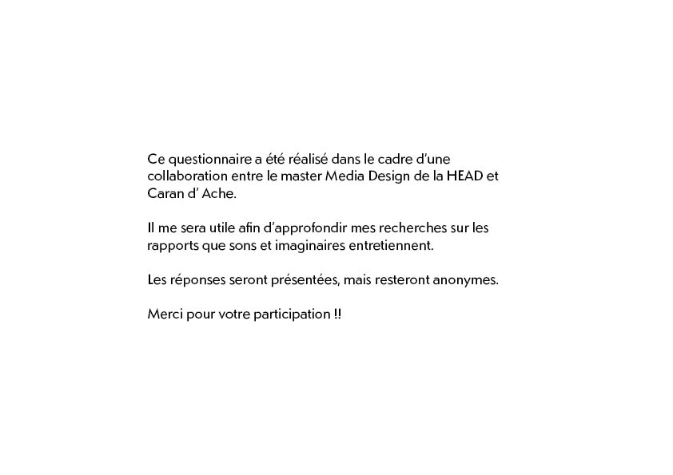
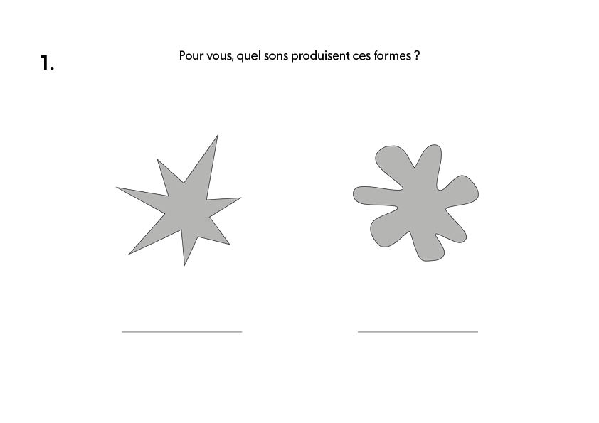
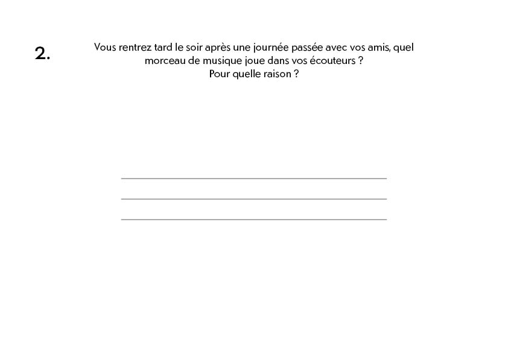
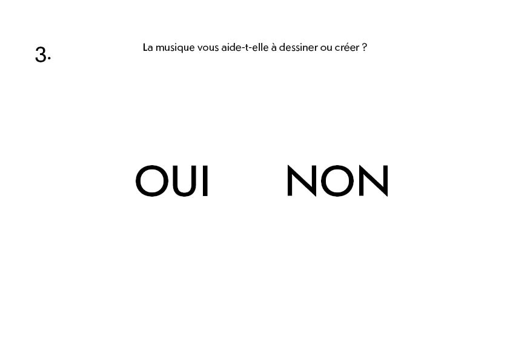
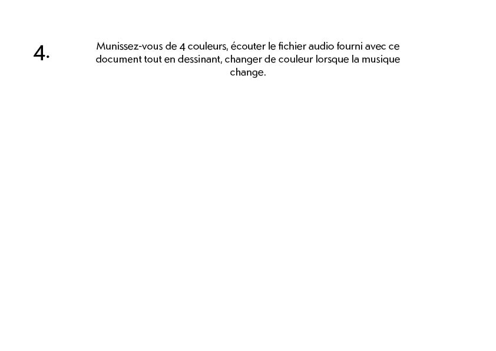
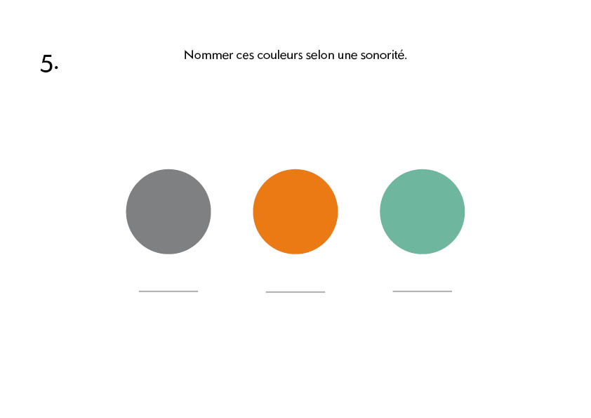

06-11-2023
# Workshop & Q&A V02
---

### Update notes : 

-> field research Q&A 02 is ready.

---

### V log :

I'm curently learning TouchDesigner in classes.

back home and i had some time before sleeping so, here's finally the updated version of my field research questionary.

I will be testing it during this week with my prototypes

---

