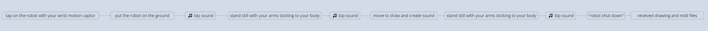

11-11-2023
# Preparing Presentation for 2023-11-13

---

### Today objectives :
1. Writing a “pitch” describing your project in 1000 characters or less. Stick to the basics: what, who, where, and how (i.e. interactions). Be specific in your choice of words.

2. A user journey or a scenario showing the key interaction (think from start to finish - show the whole experience)
 
3. Your key insights from your research (what are you basing your project on? Don’t just show other artists references, we want to see you own field research)
 
4. Your paper prototypes showing your design explorations. The focus should be on exploring possible interactions via multiple user tests. So don’t just show one prototype. More is better.
 
5. Pictures and/or videos of the user tests of your prototypes
 
6. Tentative conclusions. What are your next steps?

---

### Objectives done : 

1. done

2. done

3. X

4. done

5. X

6. X

---

### Update notes : 

1. -> 

#### What:

For my Caran d’Ache project, I’ve chosen to focus on the relationship between sound and drawing, utilizing body movement as the primary drawing tool. The robot would bring together the joy of drawing and the magic of generative music. It is aiming to create a discussion and collaboration between you and the robot, resulting in the creation of a unique drawing and a sound composition.

#### Who:

The robot would be designed for people of all ages, for art enthusiasts but also could be useful to musicians and illustrators.

#### How:

There are many possible scenarios that could work for this project.

How does it start? 
- You attach a bracelet that capture movement to your wrist, you then need to touch the robot with it to activate it. Placing the robot on the ground would make a tiny sound saying it’s ready. You start your drawing by having your arms straight to your body, another sound could indicate that you can start moving. Draw as you want by moving your arm, then stay still for 5 seconds to stop the process.
-  You attach multiple motion captor, to your wrist and feet so you can use all your body. Then same as the first option.
- The robot is already activated and is already doing his own thing. You interact with it by going closer to it or being detected by a camera.

How are the movement detected?

- motion captors
- camera 
- distance detection

How does the robot move?

- rolling
- still
- walking

How does the robot draw?

- The robot would move on a physical drawing canvas like paper and could not go beyond it. Making it draw physically on paper with a pencil or pen attached to it.
- The robot is free of his movement and can go everywhere, this would result in it not having a pencil but a digital canvas that would be sent to you when you decide that your drawing is over.
- The robot is fixed and does not move it only detect your movement and create music and drawing based on it. This allows it to draw physically or digitally but also to detect more than one person making it more collaborative and generative.

What about the sound?

- The sound would be like a discussion; you make sound when you move, and the robot respond with another sound.
- The sound is a direct answer to the robot movement, you create sound through your movement and are synchronized with the robot.
- the sound is traduced in a midi file that you can use in sound composition later in your projects.

What is the AI for?

- The AI could be used to introduce behaviour to the robot like taking its own movement decision or composing its own music.
- The AI could help traduce your movement into more concrete shapes -> circle your arm -> draw a sun or so.
- The AI could be used to create more stable gesture recognition or can learn from you to create a more precise workflow.
- The AI could be used to detect more precisely the canvas it is drawing on and adapt its position.

### For the current state of my Caran d’Ache project, I’ve opted for the following solutions: 

You attach multiple motion captor to your wrist and feet, allowing the utilization of your entire body for interaction. Placing the robot on the ground would make a tiny sound indicating it’s ready. 

You start your drawing by having your arms straight to your body, another sound could indicate that you can start moving. Draw as you want by moving your arm and body, then stay still for 5 seconds to stop the process. 

The robot would have a rolling mechanism granting it freedom of movement to traverse the room. The absence of paper gives you more space to play with but also a digital canvas that would be transmitted to you when you conclude your drawing session. 

The sound would respond directly to the movement you and the robot make, creating a synchronized audio experience. The generated sound could be translated into a midi file that you can use in sound composition later in your projects. 

The AI is here to introduce different random behaviours to the robot. These would give some freedom to the robot to make its own movement decisions or even compose its own music and make it act like an art collaborator.

#### Where:

I aim for the project to be exposed in a gallery, but it would require a medium-sized room to make it work depending on the solution I choose. That is why, it could also integrate your home or any space that encourages free and expressive body movement. The drawing robot would adapt to your environment, turning your rooms into a musical canvas for your imagination. 

---
2. -> 

---
3. -> 

---
4. -> 4 paper boxes as for now, sound prototypes and some drawings of possible shapes.

---
5. -> 

---
6. -> 

---

### V log :

14:30 -> started to work on the pitch for 2023-11-13

15:30 -> updating github

15:35 -> continuing presentation

17:30 -> family meeting

21:45 -> back to work

22:37 -> finished audio file for field-research-02

22:49 -> finished writting the "How" section for the pitch with the possible variations and scenarios.

23:33 -> posting the pitch to github and working on the visual presentation

00:07 -> end of the day