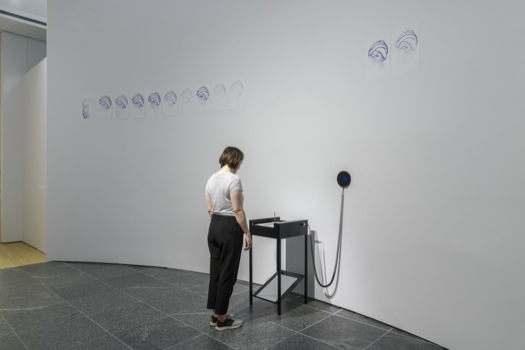

12-11-2023
# Preparing Presentation for 2023-11-13

---

### Today objectives :

1. collecting Field research 02 output

2. new possible forms

3. next steps ?

4. Testing prototype

5. finishing presentation pdf

6. printing text for presentation

---

### Objectives done : 

1. None : ,(

2. done

3. done

4. done

5. done

6. done

---

### Update notes : 

1. -> got only one response for now on my field research_02, i'll have to wait to get more ...

---

2. -> here are 5 possible simple shapes to start with. and onw possible other outcome.

shape01

shape02

shape03

shape04

shape05

---

#### As an other possibility for my project i was thinking of a fixed robot that record peoples movements and translate them into drawings and sounds.

inspired  by this project 

###### Francisco Sanchez - Seismoscopes

-recordings of the room vibrations made by visitors into a drawing.

https://www.lozano-hemmer.com/seismoscopes.php

---

3. -> 

### Tentatives/conclusions

4 testing situations where made with the box during the day.

For the first one i tried to create a Q&A style dialog between me and the robot. I make some movement, the robot answer by copying them and then producing a higher or lower pitch similar sound. This option is maybe the most basic one and maybe the most boring one too. But the video is quite interesting as a starting point for the user journey.

The seccond one focus on not having a motion captor attatched to your wrist. The dialogue now work in a more musical way with a synth instead of a basic sinewave. You interact with the robot when you get close to it, he will then try to run away from you. If you decide to step back he will then follow you. This could be a fun aproach with having multiple robots on the ground and seeing them interact with you when you get closer to them, it also make them feel a bit more than just a cube. It could also be a fun way to create visuals based on how you meet the robot and mark down your interaction in a simpler way.

the third one is where I think things kind of failed a little bit. This one was supposed to test multiple arm movement into drawings with the restriction of the robot only being able to draw on the ground. Too many movement is too confusing and does not help on how the robot could read them also, the paper is a big limitation to the freedom and character of the robot.

The fourth one is a test with multiple movement making direct sound and movement feedback. Maybe the one that is closer to a complete control over the robot. I tried also to incorporate multiple hand movement again but it made it confusing again.

Conclusion : I will not try to incorporate multiple body tracking unless i'm choosing the seccond solution.

Next Step : Maybe the robot should not move but only draw ? is it usefull having a rolling assistant for visual feedback only now that he draw on a diital plane ? it feels more natural to walk than to move your arm like an octopus. I also need to get more feedback on my seccond questionary to develop more insights.

---

4. -> done

---

5. -> done

---
### V log :

9:42 -> uploaded user journey on 2023-11-11 readme file

10:30 -> working on the presentation and sketching possible forms

12:20 -> break

13:12 -> back to work

14:00 -> recording the prototype testing

15:30 -> doing the video montage

17:05 -> adding sound to the videos

20:13 -> 3 out of 4 video done // updating github

20:32 -> dinner break

20:55 -> back to work 

21:01 -> finished adding sound to the 4 prototype video

21:15 -> finishing the presentation

22:20 -> writing for github and finishing the next step text.

22:58 -> finished conclusion // printing text (2023-11-11) for tomorrow

23:29 -> posting a cleaned up presentation in today folder