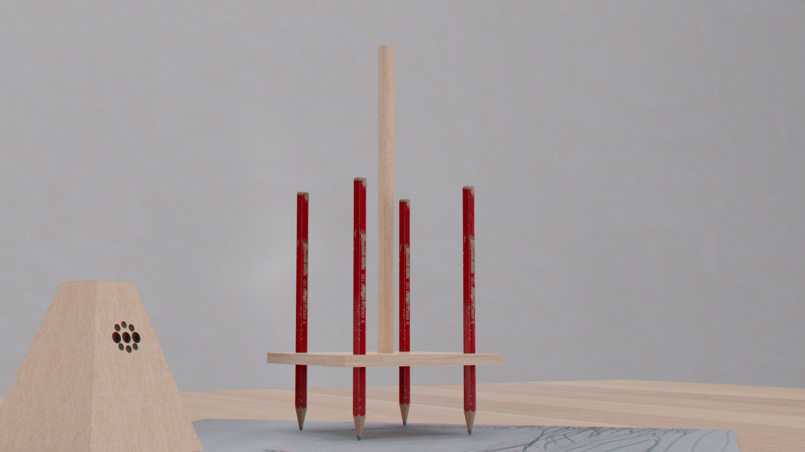
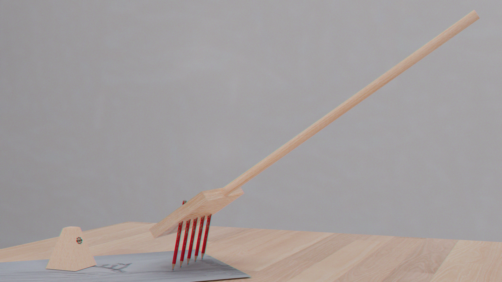
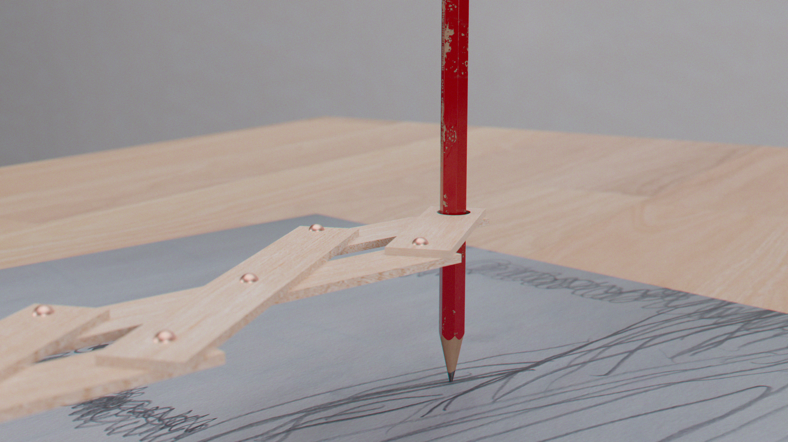
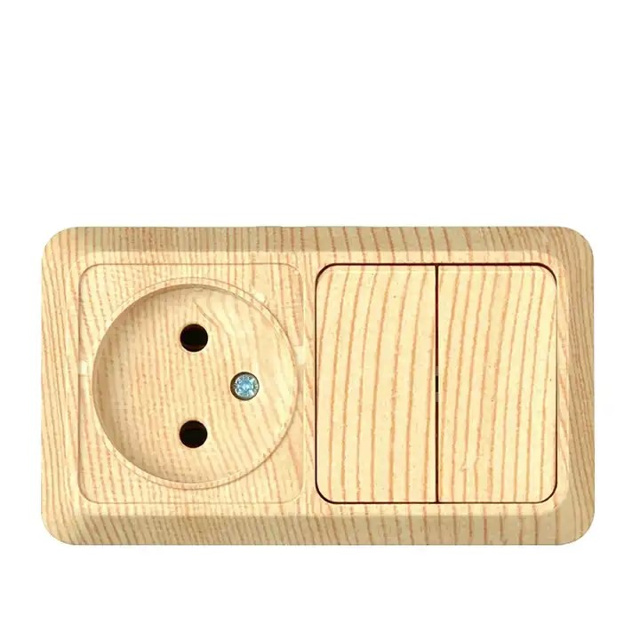

14-11-2023
# Preparing Presentation for 2023-11-15
---

2 possible outcome : 

### 1. (the one pitche for 2023-11-12)

- You draw with hand movement
- the robot translate your movement into drawings
- sound is made throught your hand movement
- 3 forms -> robot with attached pencil
- 3 ways of recording movement

### 2. (will be pitched the 2023-11-15)

- you draw with weird tools
- the robot read your drawing and translate it to sound
- sound is made by the robot
- robot without pencils
- 3 or more drawing tools

---

for now i choosed option number two :

### 2. 

### Pitch :

Suètone is a generative music box that use your drawings as partitions. 

Designed for people of all ages, it transforms your drawings into musical canvas.

Use one of the many drawing tools provided with it to generate line patterns that Suètone will be wandering and singing on.

This musical AI assistant has its own random behaviours permitting to generate limitless sounds compositions for you to listen to.

---

### User Journey / Scenario : 

- Use one of the drawing tools to draw a composition.

- Start up the robot by placing it on your paper sheet and pressing the button on top.

- Listen to your creation.

---

### Field observations & Key Insights : 

For my research i focused on creating exercises based on the relationship between sound, colors and forms. 

Drawing sound in a flowing motion allowed people who are not into drawing to liberate themself from the pressure of creating «good art» and not beeing «able to draw».

The outputs inspired this prototype and his fonction. 

---

### Shape research & developpement : 

---

### Visual and material moodboard : 

---

### Paper prototype : 

---

### User tests : 

