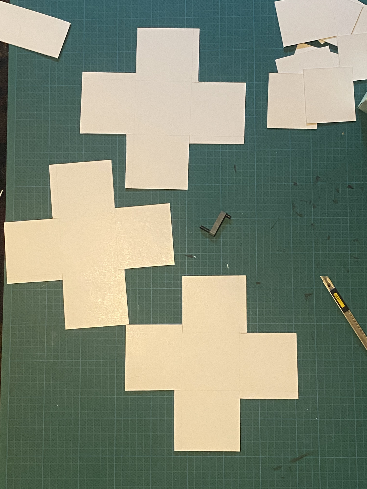

01-11-2023
# Studio Work 

---

### Today objectives :
1. Creating list of possible activation and chose one for each box
2. Prototype 2 -> grey box (with crank)
3. Prototype 3 -> Colorful/flashy box (with clicky button)
4. Prototype 4 -> white box (shaking to activate)
5. Sound design prototype
6. Taking prototype 1, 2, 3, 4 pictures and upload on Github/slack
7. Video of the prototype testing (and adding the prototype sounds to it)
8. Adding new list of references ( emotional robots references )

---

### Objectives done : 

1. X

2. Curently working on it

3. Curently working on it

4. Curently working on it

5. X 

6. X

7. X

8. X

---

### Update notes : 

1. -> 

---

2. -> Box cutout done 

---

3. -> Box cutout done 

---

4. -> Box cutout done 

---

5. ->

---

6. ->

---

7. ->

---
8. ->

---

### V log :

10:30 -> took pictures of the green box and started to work on the other ones

11:20 -> box are ready to be glued and folded. I also found what could be the crank on the grey one.

