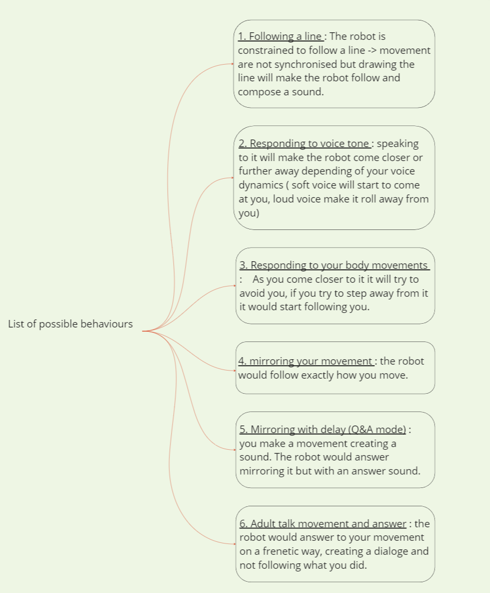

01-11-2023
# Studio Work // prototyping

---

### Today objectives :
1. Continuing/finishing GIThub cleanup and update
2. Prototype 2 -> grey box
3. Prototype 3 -> Colorful/flashy box
 ##### (these will be usefull to get more insight about how we feel toward the robot.)

4. Creating an ABC/list of behaviours
5. Thinking about the user journey
6. Sound design prototype
7. Taking prototype 1 (green pastel box) pictures and upload on Github/slack
8. Final github update and adding todaday feedback

---

### Objectives done : 

1. Done (Continued)

2. X

3. X

4. Done

5. X - (will come later with the 2023-11-02 prototype tests) -

6.  One out of 4 or 6 Done

7. X

8. X

---

### Update notes : 

1. -> continued to cleanup and archive work, texts and ideas on GIThub (about 70% of archiving done)

---

2. -> X

---

3. -> X

---

4. -> created a list of possible behaviours for the seccond idea prototype (rolling cube) :

note : these need to be tested the 2023-11-02 with the 3 colored prototypes.

---

5. -> X

---

6. -> Did the first sound prototype in ableton. Will be using a pad to trigger the sounds during test day.

---

7. -> X

---

8. -> Cleaning and organising my files took almost my entire day, will be continuing prototyping tomorrow.
