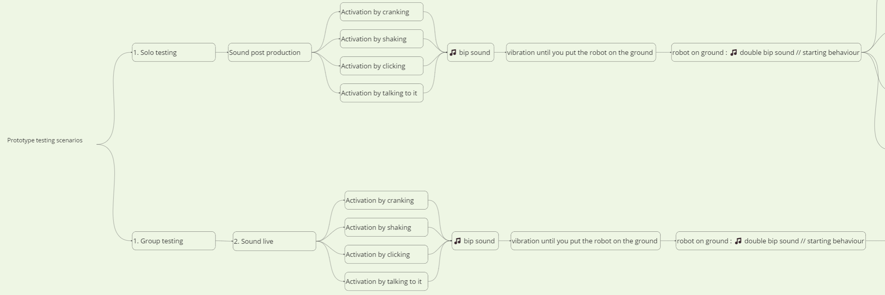

04-11-2023
# Studio Work // Prototype-Testing

---

### Today objectives :
1. Sketching/Planning the testing experience
2. Sketching possible shapes
3. Testing prototype and derushing videos
4. Adding a short presentation to the 2023-11-02 readme file in presentation folder
5. Finishing 2023-11-03 Github update
6. Final github update and adding todaday feedback
---

### Objectives done : 

1. Done

2. X

3. X

4. X

5. Done

6. X

---

### Update notes : 

1. -> 
Prototype testing scenario branching :

---
2. -> 

---
3. -> 

---
4. ->

---
5. -> 

---
6. -> 

---

### V log :

13:00 -> Slow paced brainstorm.

15:00 -> Working on the prototype testing scenarios and the 2023-11-02 presentaion i realised i was late for ...

15:15 -> Working on pictograms for the 2023-11-02 presentation.

15:47 -> Uploading prototype testing branch on the Github.

16:04 -> converting 2023-11-02 Audio file to MOV -> so it show in the readme file

16:08 -> added mov audio files to 2023-11-02 Process folder

16:16 -> Audio files are now playable in 2023-11-02 readme file

17:29 -> Had to go to a party ! hoped to test my prototype there but it was not really the mood so i'll try it next week.

