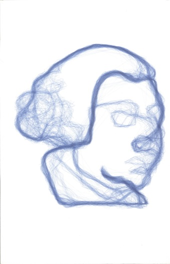
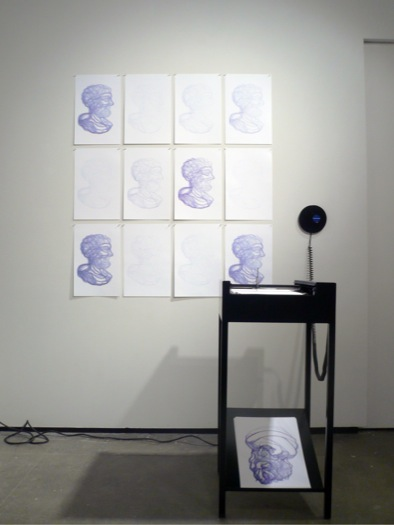
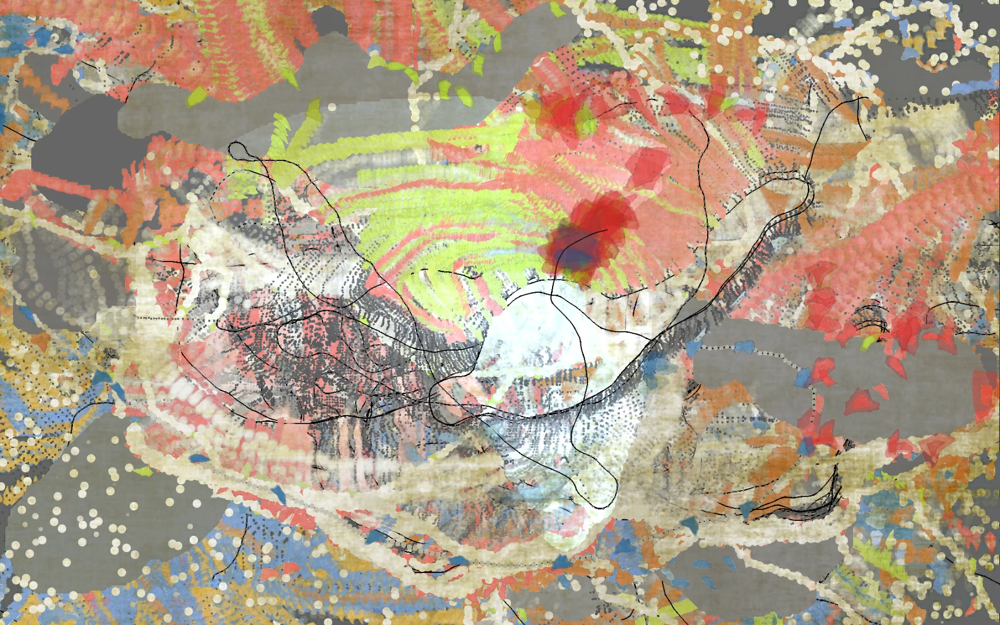
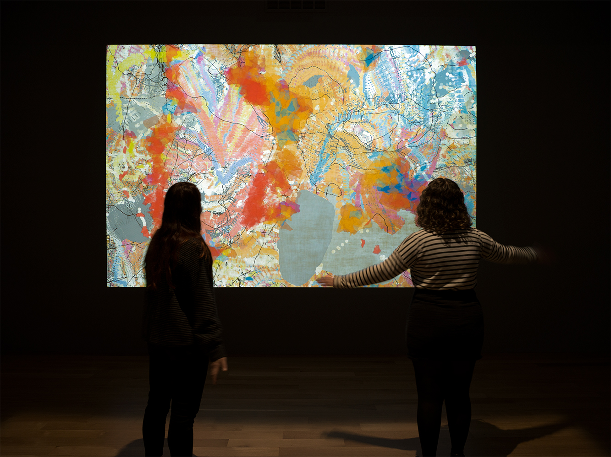
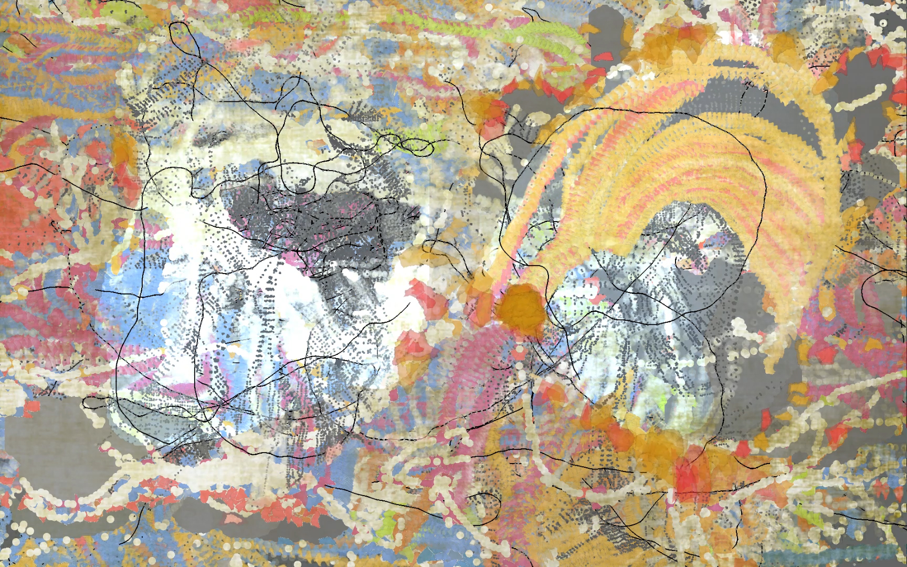
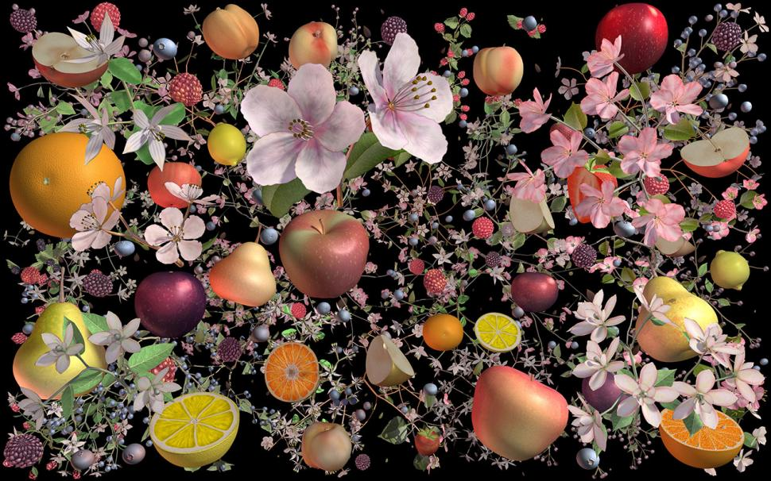
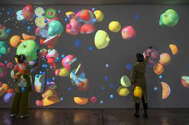
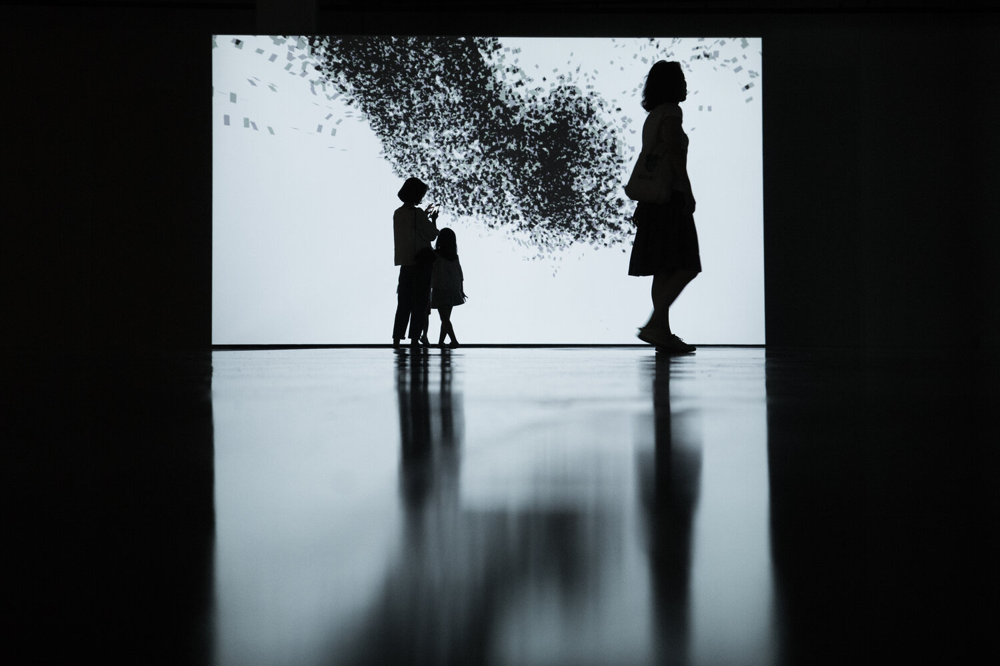

08-11-2023
# Workshop & Reference research
---
### No objectives for today

i just worked on some references and inspiration digging for the project, this will help me open up the possibilities and maybe inspire and change some parts of the current project.

---

### List of references

###### Francisco Sanchez - Seismoscopes

-recordings of the room vibrations made by visitors into a drawing.

https://www.lozano-hemmer.com/seismoscopes.php

---

###### Camille Utterback - Precarious

https://camilleutterback.com/projects/precarious/

---
###### JENNIFER STEINKAMP - Still-Life 

https://www.lehmannmaupin.com/artists/jennifer-steinkamp

---
###### Daniel Rozin

-interesting sculptural forms that ract to movement or sound creating cinetic pieces.

https://www.instagram.com/dannyrozin/?hl=fr

---
###### Messa di Voce

-cool performance from Golan Levin, Zachary Lieberman, Joan LaBarbara and Jaap Blonk.

https://www.youtube.com/watch?v=STRMcmj-gHc

---

###### RANDOM INTERNATIONAL - ALGORITHMIC SWARM STUDY

https://www.random-international.com/algorithmic-swarm-study-1-2019

---

###### Nils Völker - Thirty Six

-inflating baloon influenced by the presence of visitors.

https://vimeo.com/30684279