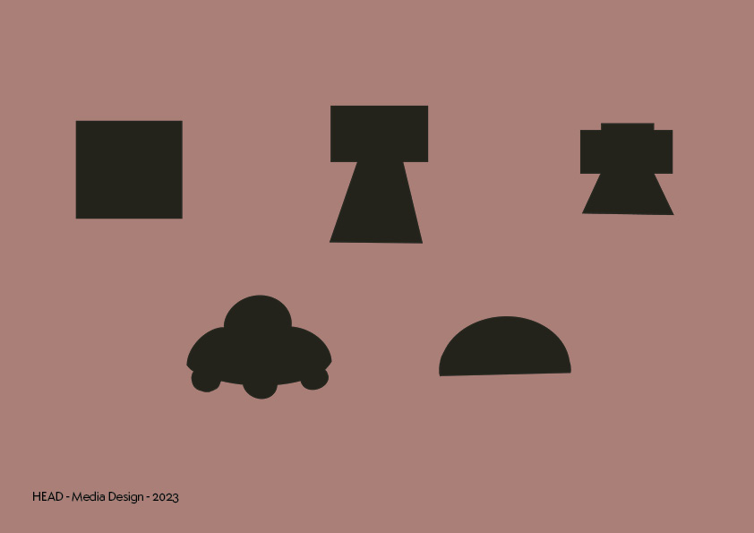

 

 

#### What:

For my Caran d’Ache project, I’ve chosen to focus on the relationship between sound and drawing, utilizing body movement as the primary drawing tool. The robot would bring together the joy of drawing and the magic of generative music. It is aiming to create a discussion and collaboration between you and the robot, resulting in the creation of a unique drawing and a sound composition.

 

 

#### Who:

The robot would be designed for people of all ages, for art enthusiasts but also could be useful to musicians and illustrators.

 

#### How:

### For the current state of my Caran d’Ache project, I’ve opted for the following solutions: 

You attach a motion captor to your wrist, allowing the utilization of your hand as tracking. Placing the robot on the ground would make a tiny sound indicating it’s ready. 

You start your drawing by having your arms straight to your body, another sound could indicate that you can start moving. Draw as you want by moving your arm, then stay still for 5 seconds to stop the process. 

The robot would have a rolling mechanism granting it freedom of movement to traverse the room. The absence of paper gives you more space to play with but also a digital canvas that would be transmitted to you when you conclude your drawing session. 

The sound would respond directly to the movement you and the robot make, creating a synchronized audio experience. The generated sound could be translated into a midi file that you can use in sound composition later in your projects. 

The AI is here to introduce different random behaviours to the robot. These would give some freedom to the robot to make its own movement decisions or even compose its own music and make it act like an art collaborator.

( research linked to the prototype testing videos )

 

 

 

 

 

 

 

### Tentatives/conclusions

4 testing situations where made with the box during the day.

For the first one i tried to create a Q&A style dialog between me and the robot. I make some movement, the robot answer by copying them and then producing a higher or lower pitch similar sound. This option is maybe the most basic one and maybe the most boring one too. But the video is quite interesting as a starting point for the user journey.

The seccond one focus on not having a motion captor attatched to your wrist. The dialogue now work in a more musical way with a synth instead of a basic sinewave. You interact with the robot when you get close to it, he will then try to run away from you. If you decide to step back he will then follow you. This could be a fun aproach with having multiple robots on the ground and seeing them interact with you when you get closer to them, it also make them feel a bit more than just a cube. It could also be a fun way to create visuals based on how you meet the robot and mark down your interaction in a simpler way.

the third one is where I think things kind of failed a little bit. This one was supposed to test multiple arm movement into drawings with the restriction of the robot only being able to draw on the ground. Too many movement is too confusing and does not help on how the robot could read them also, the paper is a big limitation to the freedom and character of the robot.

The fourth one is a test with multiple movement making direct sound and movement feedback. Maybe the one that is closer to a complete control over the robot. I tried also to incorporate multiple hand movement again but it made it confusing again.

Conclusion : I will not try to incorporate multiple body tracking unless i'm choosing the seccond solution.

Next Step : Maybe the robot should not move but only draw ? is it usefull having a rolling assistant for visual feedback only now that he draw on a diital plane ? it feels more natural to walk than to move your arm like an octopus. I also need to get more feedback on my seccond questionary to develop more insights.

#### Where:

I aim for the project to be exposed in a gallery, but it would require a medium-sized room to make it work depending on the solution I choose. That is why, it could also integrate your home or any space that encourages free and expressive body movement. The drawing robot would adapt to your environment, turning your rooms into a musical canvas for your imagination. 

